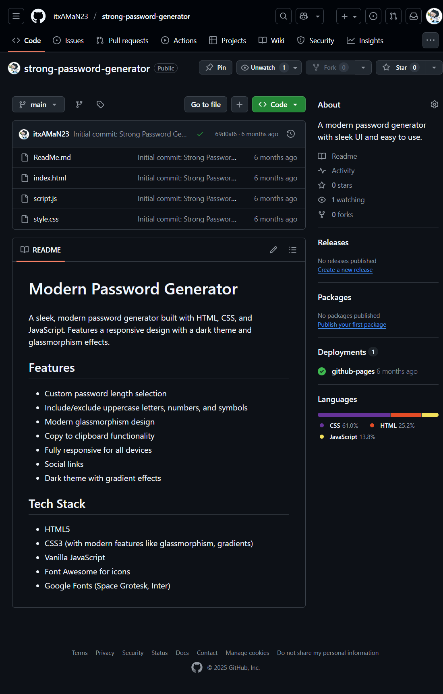

# 🔐 Modern Password Generator

A sleek, modern password generator built with **HTML, CSS, and JavaScript**.  
Features a responsive glassmorphism design, dark theme, and password customization options.

---

## 🚀 Live Demo
👉 [View it here](https://itxaman23.github.io/strong-password-generator/)  

---

## ✨ Features
- Custom password length selection
- Include/exclude uppercase letters, numbers, and symbols
- Copy to clipboard functionality
- Modern glassmorphism design
- Fully responsive for all devices
- Dark theme with gradient effects

---

## 🖼️ Screenshot
 

---

## 🛠 Tech Stack
- **HTML5**
- **CSS3** (glassmorphism, gradients, dark mode)
- **JavaScript**
- **Font Awesome** (icons)
- **Google Fonts** (Space Grotesk, Inter)

---
